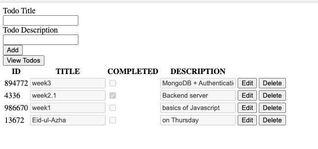

This is a basic todo app with raw HTML and a basic backend. 
- Raw HTML is used to learn about DOM manipulation to learn about pre-React era!
- We have removed unnecessary API calls  
- 'todoServerWithFiles.js' uses files for storage
- 'index.js' uses MongoDB for storage
- If you want to run the API locally, 
- inside 'index.html' change the string 
- from 'https://todo-app-github.vercel.app'
- to 'http://localhost:3000'
- To deploy on vercel
- [follow this article](https://andrewbaisden.medium.com/how-to-deploy-a-node-express-app-to-vercel-6fa567a041e2)
- we will need to keep the 'index.html' file
- inside 'public' folder
- and add the '/' end point serving the 'index.html' file
- finally, don't forget to keep the DB connection string secret!
- Store it in an .env file. 




- #1 run ```npm i -g vercel``` (to install vercel CLI globally)
- #2 Create an Express project
- #3 Name the server file 'index.js'
- #4 Add the start script inside 'package.json'
- ```"scripts": {
        "start": "node index.js"
    },```
- #5 Deploy to Vercel by running ```vercel``` in the CLI
- #6 in the root dir, add 'vercel.json'
- ```json
{
    "version": 2,
    "builds": [
        {
            "src": "./index.js",
            "use": "@vercel/node"
        }
    ],
    "routes": [
        {
            "src": "/(.*)",
            "dest": "/"
        }
    ]
}```

- #7 Run the command ```vercel``` again to build and deploy again

- However, this project is deployed directly from github to Vercel
